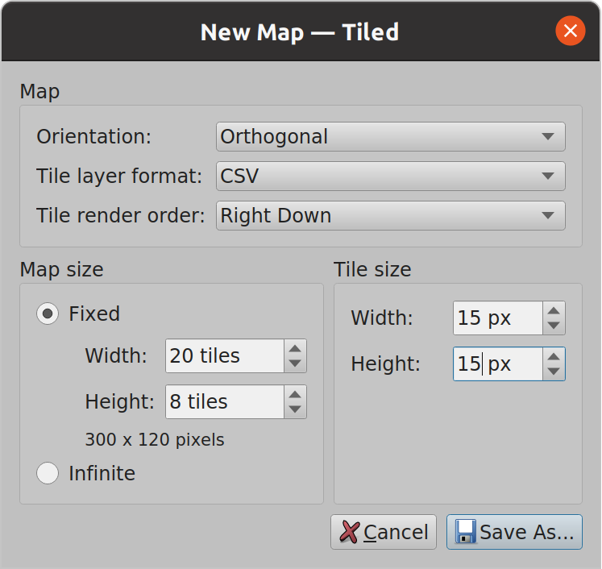
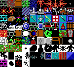
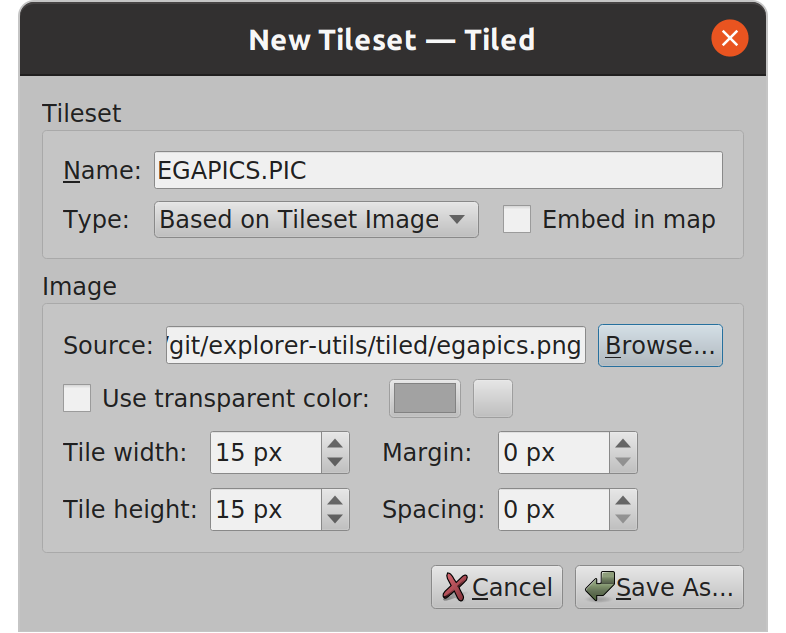

# Creating maps from scratch

If you're interested in how I made `sample.tmx` and associated files.

## Create New Map

*File > New > New Map...*. Use these parameters:

## Create Tileset

`egapics.png` is a conversion of `EGAPICS.PIC` using the `mksheet` tool, provided for the convenience of making tilesets.

In the *Tilesets* panel (defaults to bottom-right of Tiled), click the *New Tileset...* button:

